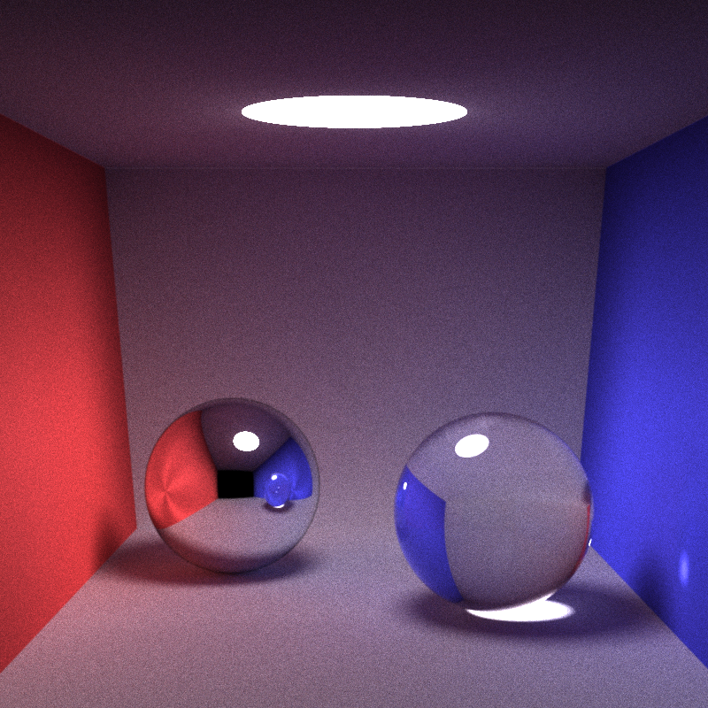
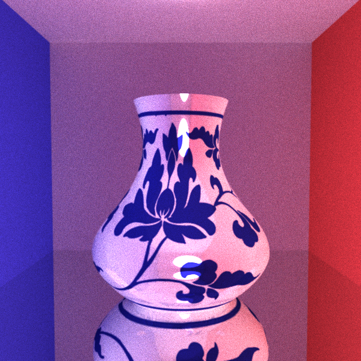
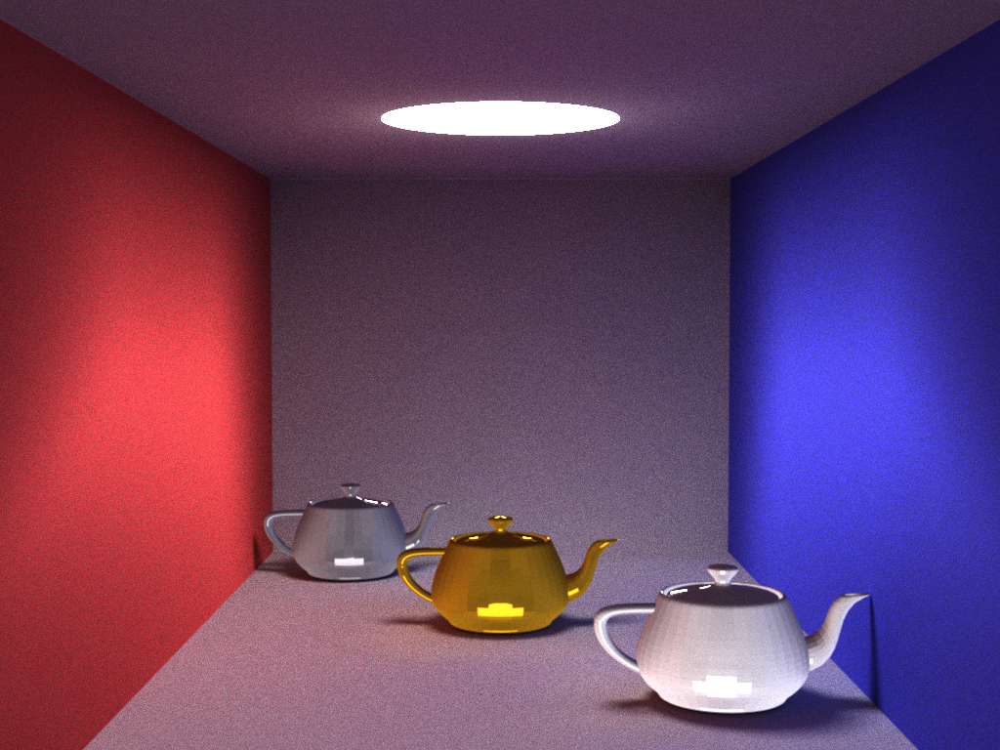
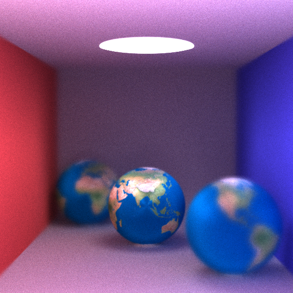

# THU2023Spring-CG-FinalProject
清华大学2023春计算机图形学基础光线追踪大作业
## 示例场景
$$\begin{center}

    
    <figcaption>康奈尔盒</figcaption>
    
    <figcaption>曲线曲面</figcaption>
    
    <figcaption>不同材质茶壶</figcaption>
    
    <figcaption>带景深的地球</figcaption>
    
    <figcaption>复杂网格</figcaption>

\end{center}$$
